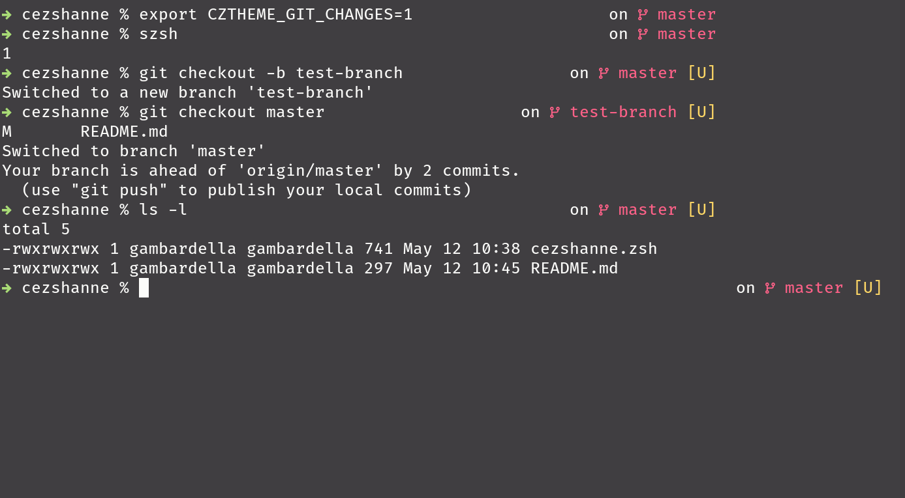

# cezshanne

A minimal, yet elegant zsh theme.



### How to install

`cezshanne` makes use of Nerd Fonts to display some custom glyphs. Be sure to download the one you like the most from their website.

[Nerd Fonts website](https://www.nerdfonts.com/#home)

Afterwards, either add the following line to your `.zshrc` file, or try it by sourcing the file directly.

```sh
source path/to/cezshanne.zsh
```

